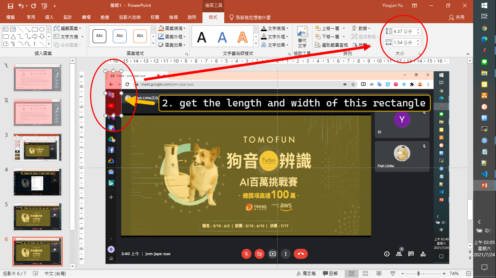

# README

[[English version]](./README.md)

WFH 參加線上會議時，不論是 Google Meet 或是其他的會議軟體，  
有時想做筆記，但苦無簡報!! 
這時候你可能會想要截圖，但是節圖會充滿很多 ~~多餘的~~ 資訊。

本專案就是協助你擷取截圖後的畫面，讓你可以單純切出想要的簡報畫面。

---

## 效果

原始畫面

測量你要擷取的區域

  

擷取結果

舒服XD~  
你也可以閱讀/下載這個[網頁](./code/main.html)，知道處理的過程。

---

## 資料夾說明

- slide_ori: 視訊會議的畫面截圖，不同議程做檔案夾分類。
- slide_fix: 經過 code 的操作後，裁切好的畫面。

---

## END
