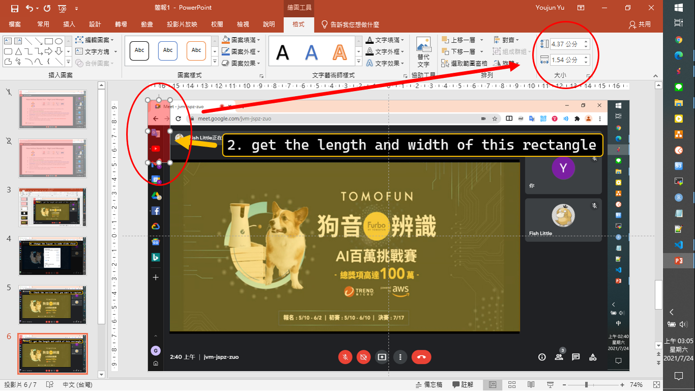
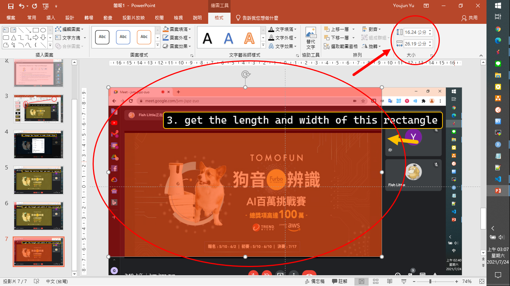

# README

[[ Chinese version ]](./README-cht.md)

You may want to make some note for online meeting when WFH.  
However, you lack of slide and so you just snapshot the screen.  

**But you find there are so many redundant infomation on thesnapshot.**

Yep! this repo can help you to capture the section that you want.
After that you can make a slide or take a note from those capture image!

---

## What is Look Like

original image

measure the length and width of section you want.

  

capture image

Bravo!  
You can read/download this [webpage](./code/main.html) to get familiar with how it achieves.

---

## Folder

- slide_ori: put your snapshot here. you can even put different sessions in separate folders
- slide_fix: after process, the capture will save here and auto create the same structure like `slide_ori` folder。

---

## END

---

## TO DO LIST

- serverless structure
- coding for PDF to High Quality PNG
  - https://hnet.com/pdf-to-png/
  - https://stackoverflow.com/questions/6605006/convert-pdf-to-image-with-high-resolution
- build a website or API to make most use of this tool.
- Need a more intuitive method to measure the length and width of the section you want to capture.
